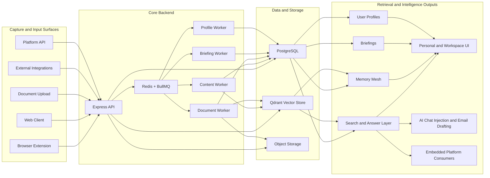

# Cognia Product Whitepaper

Written: April 1, 2026

## Executive Summary

Cognia is an AI-native memory system designed to capture context, structure it into durable knowledge, and make that knowledge retrievable at the moment of work. The product already operates across two distinct but connected modes:

- a personal memory layer that captures and organizes an individual user's browsing and research activity
- a team workspace layer that ingests organizational documents and connected systems for shared retrieval, collaboration, and briefing

At a product level, Cognia sits between note-taking, enterprise search, and knowledge management. It is not just a storage layer, and it is not just a chat interface. Its core proposition is that work context should be continuously captured, normalized, connected, and re-used.

The codebase shows a product with real operational depth:

- browser-based passive capture
- document ingestion and chunk-level indexing
- semantic and hybrid retrieval
- AI-generated answers with citations
- a visual knowledge graph called the Memory Mesh
- recurring personal and team briefings
- workspace security controls such as 2FA enforcement, session timeout policies, and IP allowlists
- a platform API for embedded document workflows and matter-aware search

The strongest interpretation of Cognia today is this: it is becoming a memory operating system for individuals and teams that want to turn fragmented digital activity into usable institutional intelligence.

## The Problem Cognia Solves

Modern knowledge work is spread across browser tabs, documents, SaaS tools, email threads, and chat systems. The problem is not lack of information. The problem is loss of context.

Teams repeatedly pay the same tax:

- valuable research is consumed once and then forgotten
- documents are stored, but not truly understood
- search finds files, not answers
- individual learning does not compound into team memory
- intelligence remains trapped inside tools instead of flowing into decisions

Cognia addresses this by treating every captured item as a future retrieval asset. Rather than waiting for users to organize information manually, the system captures, processes, scores, embeds, links, and surfaces it automatically.

## What Cognia Is

Cognia is best understood as a multi-surface memory platform with five product layers.

### 1. Personal Memory Layer

For personal accounts, Cognia captures web context through a browser extension and turns it into searchable memories. These memories are deduplicated, summarized structurally, embedded semantically, and linked into a graph.

This makes Cognia useful as:

- a research memory for founders, operators, analysts, and builders
- a personal retrieval system for articles, pages, and references
- a context source that can be injected back into AI workflows

### 2. Team Workspace Layer

For organization accounts, Cognia provides a shared workspace where teams can:

- upload documents
- invite members with role-based access
- search across shared content
- visualize organizational knowledge as a mesh
- configure security and sync defaults

The current workspace model is document-first. The repository also includes a clear next-step product direction around `Spaces`, but that model is explicitly not wired into the live organization workflow yet.

### 3. Intelligence Layer

Cognia does not stop at retrieval. It generates higher-order outputs on top of captured knowledge:

- personal daily digests
- weekly synthesis briefings
- trend alerts
- team reports
- evolving user profiles derived from memory history

This moves the product from passive archive to active intelligence system.

### 4. Integration Layer

The product includes an integration framework for external systems. The current integration service is built around provider plugins, encrypted token storage, sync jobs, webhook registration, and synced-resource tracking. The implementation shows active support for:

- Google Drive
- Notion
- Slack
- Box

This matters because Cognia is not limited to browser capture. It is designed to become the ingestion layer for broader organizational context.

### 5. Embedded Platform Layer

The platform API exposes tenant sync, document upload sessions, document retrieval, citations, and search. It already includes matter-aware search modes and metadata fields such as `matterId`, `clientId`, `privileged`, and `securityTags`.

That is a meaningful signal: Cognia is architected not only as an end-user app, but also as an embeddable intelligence substrate for document-centric workflows, especially in regulated or high-context environments.

## Core Product Experience

### Passive Capture Through the Browser Extension

The extension is a primary acquisition and retention surface. It quietly monitors browsing activity, extracts visible page content, tracks user activity, and sends meaningful context to the backend when the content is worth storing.

Important product behaviors visible in the implementation:

- localhost is excluded from capture
- blocked websites can be configured
- privacy-extension conflicts are detected
- capture requires meaningful text, not just page chrome
- content changes are monitored to avoid redundant capture

This is not a naive scraper. The extension is trying to capture real reading context, not every page event.

### AI Assistance Inside Existing Workflows

The extension also pushes Cognia into moments of action:

- in AI chat interfaces, it can search Cognia and inject relevant memory context into the prompt
- in Gmail and Outlook compose flows, it can generate draft replies from the current thread context

This is strategically important. Cognia is not just a destination product. It is trying to become ambient infrastructure that improves the tools people already use.

### Shared Search in the Team Workspace

The team workspace search flow is one of the clearest expressions of the product thesis. Organization search pulls from shared organization content and can also include the authenticated user's personal extension memories. In practice, that means Cognia can blend:

- uploaded documents
- synced integration content
- personal browsing context

into one grounded answer experience with citations.

That combination is a product differentiator. Most enterprise search systems either ignore personal context or keep it completely separate from team knowledge.

### The Memory Mesh

The Memory Mesh is Cognia's knowledge graph and visualization system. It is not just a UI flourish. It reflects the product's internal model of knowledge as a network rather than a list.

Relations are built across three dimensions:

- semantic similarity via embeddings
- topical overlap via extracted metadata
- temporal proximity via time-based decay

The system then computes a 3D layout using latent-space projection and edge pruning so users can explore clusters of related knowledge visually.

This gives Cognia a strong "knowledge topology" identity rather than a conventional folder-and-search identity.

## System Architecture

The product architecture is best understood as a capture-to-intelligence pipeline. Multiple input surfaces feed a shared backend, which persists memory objects, generates embeddings and relations, and then serves retrieval and synthesis back into user-facing and embedded workflows.

## How the System Works

### Ingestion Pipeline

The ingestion path is disciplined and layered:

1. Content arrives from the extension, document upload, API, or integration sync.
2. Content is canonicalized and hashed.
3. Duplicate detection checks canonical matches and recent URL-level similarity.
4. Structured metadata is extracted, including topics, categories, searchable terms, entities, and retrieval text.
5. Importance and confidence scores are inferred.
6. The memory is written to PostgreSQL.
7. Background workers generate embeddings and create relations.
8. Embeddings are stored in Qdrant for semantic retrieval.

This is an important product-quality signal: Cognia is not merely storing raw text blobs. It is building retrieval-grade memory objects.

### Document Intelligence

Document upload is implemented as a first-class enterprise workflow:

- files are uploaded to storage
- processing jobs are queued
- text is extracted from supported formats
- documents are chunked
- each chunk becomes a searchable memory object
- chunk-to-document linkage is preserved for citation and preview

This is what allows Cognia to answer questions against documents with precise source grounding rather than vague document-level references.

### Search and Answer Generation

Personal search and organization search both rely on semantic infrastructure, but they serve slightly different product needs.

The retrieval stack includes:

- vector search in Qdrant
- dynamic search policies
- query classification
- result scoring and reranking
- AI answer generation with inline citations
- background answer jobs and SSE streaming for long-running answers

For users, the result is straightforward: natural-language query in, grounded answer out. Under the hood, the system is materially more sophisticated than a simple embedding lookup.

### Briefings and Profile Intelligence

Cognia continuously converts accumulated memory into synthesized outputs.

Implemented briefing types include:

- daily digest
- weekly synthesis
- trend alert
- team report

In parallel, the profile system extracts durable user traits, interests, domains, and expertise areas from memory history. This creates a feedback loop where the system can personalize future summaries and outputs using longitudinal context.

## Product Surfaces

| Surface | Role in the Product |
| --- | --- |
| `client` | Main end-user product for personal and workspace experiences |
| `extension` | Passive capture, AI-chat context injection, and email drafting |
| `api` | Ingestion, retrieval, auth, security policy enforcement, workers, and platform endpoints |
| `admin` | Internal operational console for system health, usage, and storage analytics |

This architecture shows a product that is already thinking beyond a single interface. Cognia is a system, not just a web app.

## Security, Governance, and Enterprise Readiness

The repository shows a serious enterprise posture even where the UI is still evolving.

Implemented security and governance primitives include:

- JWT-based authentication with session cookies for web clients
- extension token issuance scoped to the authenticated user
- login and registration rate limiting
- optional user-level 2FA
- organization-enforced 2FA requirements
- organization session timeout enforcement
- organization IP allowlists
- audit log storage
- encrypted integration token storage
- organization-level billing and security configuration fields

This is not the full story of enterprise trust, but it is enough to say Cognia is being designed as a governed workspace product rather than a consumer-only tool.

## Where Cognia Is Strongest

Based on the actual implementation, Cognia is strongest when the customer has all three of these characteristics:

- high information volume
- repeated need to retrieve context later
- value in connecting personal research with team knowledge

That makes it especially well suited to:

- founders and executive teams
- product, research, and strategy teams
- agencies and consultancies
- document-heavy professional workflows
- legal or matter-based knowledge environments via the platform API

## What Is Shipped vs. What Is Next

One of the most important product truths in the repo is that Cognia already has a meaningful product, but it is also in transition.

### Shipped Product Shape

Today, Cognia is a dual-mode memory platform:

- personal knowledge capture and retrieval for individuals
- team document and integration search for organizations

That product is real and supported by substantial backend machinery.

### Next Product Shape

The `Team Memory Copilot` PRD introduces `Spaces` as the next organizational primitive. The intention is to move Cognia from a flat shared workspace toward scoped containers for projects, clients, initiatives, and workstreams.

That direction makes strategic sense. It closes the gap between a strong retrieval engine and a true operating model for team context. But the codebase is explicit that this layer is not yet active in the current organization experience.

The right interpretation is:

- Cognia today is document-first at the workspace level
- Cognia tomorrow is likely context-scoped and workstream-aware

## Strategic Positioning

Cognia should be positioned neither as a generic note app nor as a thin wrapper around LLM search.

Its strongest position is:

`an AI memory operating system for individuals and teams`

That framing is defensible because the product already combines:

- continuous capture
- structured memory formation
- semantic retrieval
- graph relationships
- workflow injection
- synthesized briefings
- enterprise policy controls
- platform APIs

That is a broader and more durable category position than "AI search" alone.

## Conclusion

The product in this repository is more mature than a surface reading suggests. Cognia is not only storing knowledge; it is building memory objects, relations, retrieval workflows, and intelligence outputs across personal and organizational contexts.

The clearest product truth is this:

Cognia is evolving from an AI knowledge graph into a memory system for real work.

Its current strengths are capture, retrieval, grounding, and synthesis. Its next major opportunity is organizational structure through `Spaces` and other scoped workflow primitives. If executed well, Cognia can become the layer where scattered digital context is transformed into reusable institutional memory.
